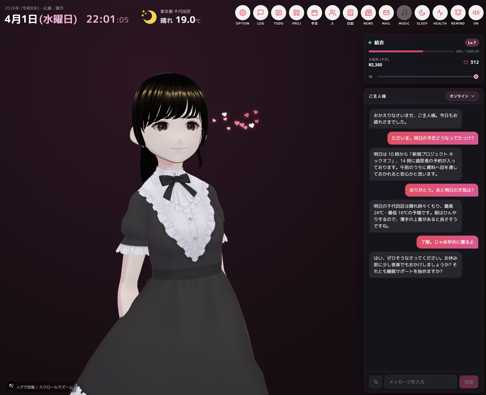

# Yui Agent

**3D アバターが声と表情で応答する、個人ホスト向け AI 秘書。**

完全パーソナルな秘書です。予定、TODO などの管理から、食事、体重などの健康管理、ニュースやメールで Yui が気になったものをお知らせ、音楽を一緒に楽しむなどなど、毎日そばにいてくれて、いろいろお世話してくれるパーソナル秘書を目指して開発しています！お気に入りの VRM を用意したら毎日使うこと間違いなし。お給料あげないとダメなんですけどね。睡眠サポート機能で一緒に寝ることもできます。



🔊 **[こんな感じで喋ります](docs/audio/yui-greeting.mp3)** (Irodori TTS 感謝してます！)

<audio controls src="docs/audio/yui-greeting.mp3"></audio>

外見はチャーミングなパーソナル秘書ですが、本当に目指している先は **Hermes など自律的に仕事をこなす AI エージェント**。内部は **長期メモリ** (= L2 always-on / L3 recent summary / L4 semantic retrieval の 3 階層)、**サブエージェント** (= mail / schedule / music の specialist runner)、**ツール基盤** (= 60+ ツール、metadata 駆動の権限制御 + 非同期 user-confirm flow + untrusted content wrap)、**スキル** (= 準備中) と、自律エージェントが備えるべき構成要素を着実に積み上げています。ご主人様の代わりに自律的に動いてくれる AI を、見た目の楽しさを保ったまま育てていきたい。

> 📜 **ライセンス**: [PolyForm Noncommercial 1.0.0](LICENSE) (= source-available、個人 / 教育 / 研究 / 自己ホスト / 非営利は完全許可、**商用販売は不可**)。OSI 定義の "open source" には該当しません (= 非商用条項のため)。

<!-- ============================================ -->
<!-- DEMO VIDEO PLACEHOLDER                       -->
<!-- github.com の web エディタで mp4 をここに    -->
<!-- ドラッグ&ドロップすると <video> タグが       -->
<!-- 自動挿入されます (推奨: 15-30s, ~25MB)。     -->
<!-- ============================================ -->

> 🎬 **動画デモ (= 準備中)** — Yui の声と表情のサンプル

<!-- ============================================ -->
<!-- SCREENSHOT PLACEHOLDERS                      -->
<!-- 機能紹介スクリーンショットをここに配置。     -->
<!-- 推奨: デスクトップ全景 + 各 modal を 1 枚ずつ -->
<!-- ============================================ -->

> 📸 **スクリーンショット (= 準備中)**

---

## こんなことができる

| カテゴリ | できること |
|---|---|
| 💬 **会話** | Sonnet / Opus / GPT / Gemini / Grok の好きな provider で、結衣の人格 + voice + 表情 + リップシンクで返答 |
| 🧠 **記憶** | 7 層メモリで過去会話 / 嗜好 / 約束を覚えてる。session 横断で「先週言ったあの話」を引き出せる |
| 📅 **予定 / TODO** | Google Calendar 同期 + 自前 TODO / プロジェクト管理 + 横断 M:N で「○○ プロジェクトの予定」をまとめて見る |
| 📧 **メール** | Gmail 統合 + RAG ベース自動分類 + 「これは重要」学習ループ + 送信 / 下書き / 校正 |
| 📰 **ニュース** | RSS 6 ソース自動キュレーション + 朝のブリーフィング |
| 🎵 **音楽** | Spotify 再生制御 + 「ジャズかけて」音声 / テキスト両対応 + 楽曲解説 trivia |
| 💪 **ヘルス** | 会話から食事 / 運動を自動抽出 + 体重 / 気分 quick-save + iOS HealthKit 連動 + 履歴グラフ |
| 😴 **睡眠サポート** | 認知シャッフル理論を結衣声で再現、囁き voice + CC BY BGM |
| 📔 **日記** | 寝る前に Sonnet で当日要約、Catch-up logic 付き |
| 👥 **連絡先** | 簡易 CRM + VCF import + 連絡先から TODO / 予定 / メール起票 |
| 🔔 **お便り (通知)** | 重要度 × 状態 × kind の matrix で speak / notify / silent を自動切替 |
| 💬 **Discord 連携** | text DM + SSE で push 受信 |
| 🎨 **VRM カスタマイズ** | 複数 VRM 登録 + 手動切替 + サムネ自動生成 |

機能の詳細: [`docs/feature-overview.md`](docs/feature-overview.md)

---

## クイックスタート

### 必要なもの

- **Docker Desktop** (Mac / Linux / Windows)
- **AI provider の API key** いずれか 1 つ (= Anthropic / OpenAI / Gemini / Grok)
- **Embeddings サーバ** (= memory 機能の前提)
  - 推奨: [Ollama](https://ollama.com/) (= 無料、ローカル、`ollama pull bge-m3`)
  - or OpenAI 互換 API

### 起動

```bash
git clone <repo url>
cd vroid

# 必須 env 2 つを生成
echo "AUTH_TOKEN=$(openssl rand -base64 32)" >> .env
echo "ENCRYPTION_KEY=$(openssl rand -base64 32)" >> .env

# 起動 (= 初回は build で数分)
docker compose up -d
```

ブラウザで **https://localhost:8443** を開く (= Caddy 経由 HTTPS、自己署名)。

### 初回セットアップフロー

1. ブラウザ証明書 warning → 「詳細設定 → 続行」で 1 度許可
2. `/auth` 画面で `.env` の `AUTH_TOKEN` を貼り付け → cookie 認証
3. **`/setup` ウィザード** が自動で開く:
   - **Step 1**: AI provider 選択 + API key 入力
   - **Step 2**: メイン / サブモデル + Embeddings 設定 (Ollama / OpenAI preset から選ぶだけ)
4. セットアップ完了 → `/` (= main chat) でご対面

詳細: [`docs/initial-setup.md`](docs/initial-setup.md)

### 追加の連携 (= 任意、いつでも後から)

- **Google Calendar / Gmail** → 設定 → 連携 タブ ([`docs/google-oauth-setup.md`](docs/google-oauth-setup.md))
- **Spotify** → 設定 → 連携 タブ ([`docs/spotify-setup.md`](docs/spotify-setup.md))
- **Discord bot** → `.env` に `DISCORD_BOT_TOKEN` 等
- **iOS HealthKit** → `.env` に `HEALTH_INGEST_KEY` + iOS Shortcut ([`docs/health-tracking.md`](docs/health-tracking.md) Phase 5)
- **TTS サーバ (= 声)** → 下の「声」セクション参照

---

## 声 (= TTS、Yui の魅力の中核)

Yui Agent の体験で最も差別化されるのは **「結衣の声」** です。LLM のテキスト応答を TTS サーバで合成 → **文単位 chunk 再生 + リップシンク + 表情駆動** で発話します。テキストだけのチャット bot とは別ジャンルの体験になります。

### 推奨 TTS: Irodori TTS

[Aratako さんの Irodori TTS](https://github.com/Aratako/Irodori-TTS) (= MIT License、日本語特化、Rectified Flow Diffusion Transformer) を別ホスト or 同居で立てるのが品質・速度ともに最適:

- **品質**: 日本語に特化、リアルタイムの **5-10 倍速** で合成 (= RTX 3090 で 1 文 ~0.5 秒)
- **声の固定**: Voice Design (= シードガチャ) から好みの音色を選んで `reference.wav` として固定 → 全発話を同じ声で
- **囁き対応**: 睡眠サポート用に whisper ref を別途指定可能 (= 同梱の `assets/tts-refs/whisper_ref.wav` を流用可)
- **ローカル完結**: クラウド TTS API 不要、月額なし、データ外に出ない

### セットアップ要点

完全な手順 (= サーバ構築から systemd 常駐まで): **[`docs/irodori-tts-setup.md`](docs/irodori-tts-setup.md)**

最小構成 (= 試したいだけ):

1. Ubuntu + NVIDIA GPU (= VRAM 5GB+) のホストを用意 (= デスクトップ PC 兼用 or 別マシン)
2. `git clone https://github.com/Aratako/Irodori-TTS` + `uv sync` (= 約 5 分、CUDA 12 系 PyTorch 含む 3GB DL)
3. 薄い FastAPI ラッパ (= `tts_server.py`、上記 docs に貼り付けコード)で `/tts` endpoint 公開
4. シード候補から声を選び `reference.wav` を作成 (= `seed 5, 39, 77, 150, 280, 470, 1500, 7777` あたりが定番)
5. systemd で常駐
6. Yui Agent 側の設定 → AI → TTS で `http://<server>:7880/tts` + reference 音声パスを入力

### TTS なしでも動く

「とりあえずチャットだけ試したい」なら TTS 設定は空欄で OK (= text 表示のみ、Yui は声を出さない)。VRM の表情変化と立ち振る舞いは TTS なしでも有効です。後から TTS サーバを立てて、設定画面で URL を入れれば即声付きになります。

### 同梱の voice reference

このリポジトリには `assets/tts-refs/cool_seed_7777.wav` (= 通常会話用) と `whisper_ref.wav` (= 睡眠サポート用) が同梱されています。Irodori TTS の Voice Design 出力 (= 純合成、実在人物の声には基づかない、MIT モデル経由) なので、そのまま TTS サーバにコピーして使えます。詳細: [`CREDITS.md`](CREDITS.md)。

---

## 技術スタック

- **Next.js 16** (App Router、proxy.ts 採用) + **React 19** + **TypeScript**
- **@pixiv/three-vrm** + **Three.js** (= VRM 表示 / アニメーション)
- **Postgres + pgvector** (= 会話 / 記憶 / 全データ永続化)
- **Valkey** (= Redis 互換、cache + pub-sub + 24h overlay)
- **Drizzle ORM** + 手書き SQL migration
- **Caddy** (= HTTPS 終端、自己署名 / Let's Encrypt / Cloudflare Tunnel 構成可)
- **SearXNG** (= 自前 Web 検索、docker pull で取得)
- **Anthropic SDK** + OpenAI / Gemini / Grok adapter (= multi-provider)
- **Docker Compose** 単体で完結

詳細: [`docs/architecture.md`](docs/architecture.md)

---

## ドキュメント

### システム

- [`docs/initial-setup.md`](docs/initial-setup.md) — 初回セットアップ / `/setup` ウィザード仕様
- [`docs/architecture.md`](docs/architecture.md) — リクエストフロー / Star pattern / Periodic Module
- [`docs/data-persistence.md`](docs/data-persistence.md) — DB スキーマ / Valkey / Embeddings
- [`docs/external-integrations.md`](docs/external-integrations.md) — 外部 API / OAuth / 各連携
- [`docs/deployment-and-security.md`](docs/deployment-and-security.md) — HTTPS / 認証 / SSRF / OAuth 暗号化
- [`docs/feature-overview.md`](docs/feature-overview.md) — 主要機能 一覧 (= 23 機能の概要)
- [`docs/implementation-status.md`](docs/implementation-status.md) — 実装状況 + 残タスク + 戦略ロードマップ

### 機能別 (= 深掘り)

- [`docs/memory-architecture.md`](docs/memory-architecture.md) — 記憶層の設計 (= 7 層)
- [`docs/notification-system.md`](docs/notification-system.md) — お便りシステム
- [`docs/mail-system.md`](docs/mail-system.md) — メールパイプライン全体
- [`docs/mail-classification.md`](docs/mail-classification.md) — RAG 分類 + 学習ループ
- [`docs/news-curation.md`](docs/news-curation.md) — ニュースキュレーション
- [`docs/health-tracking.md`](docs/health-tracking.md) — ヘルス全 Phase + iOS Shortcut
- [`docs/sleep-support.md`](docs/sleep-support.md) — 認知シャッフル睡眠サポート
- [`docs/ai-settings.md`](docs/ai-settings.md) — Multi-provider AI 設定
- [`docs/health-goals.md`](docs/health-goals.md) — ヘルス目標
- [`docs/affinity-system.md`](docs/affinity-system.md) — 好感度 (= 設計のみ)
- [`docs/reminders-system.md`](docs/reminders-system.md) — リマインダー / habits
- [`docs/user-profile-snapshot.md`](docs/user-profile-snapshot.md) — ご主人様プロファイル
- [`docs/routing-guidance.md`](docs/routing-guidance.md) — 道案内

### 設定 / セットアップ手順

- [`docs/google-oauth-setup.md`](docs/google-oauth-setup.md) — GCal / Gmail OAuth
- [`docs/spotify-setup.md`](docs/spotify-setup.md) — Spotify Developer
- [`docs/irodori-tts-setup.md`](docs/irodori-tts-setup.md) — Irodori TTS サーバの構築 (= 声を出すなら必須)

### 設計メモ (= 未実装 / 検討中)

- [`docs/roadmap.md`](docs/roadmap.md) — 全機能のラフ設計メモ
- [`docs/project-workspace.md`](docs/project-workspace.md) — プロジェクト ワークスペース
- [`docs/vision-feature.md`](docs/vision-feature.md) — Yui の「目」(= カメラ / 画面共有)
- [`docs/capacitor-app.md`](docs/capacitor-app.md) — iOS ネイティブアプリ

---

## ライセンス / クレジット

### コード本体

**[PolyForm Noncommercial License 1.0.0](LICENSE)**

- ✅ 個人 / 教育 / 研究 / 自己ホスト / 非営利組織での利用は完全許可
- ❌ **商用販売は禁止**
- 将来 contributor が増えた場合、合意の上で MIT への緩和を検討します

選定理由: Yui Agent は「単体で完結する personal assistant プロダクト」(= React 等の汎用ツールではない)。個人利用は自由にしてほしい一方、ソロ開発の成果を「コピーして勝手に売られる」のは趣旨に反するため。詳細: [`LICENSE`](LICENSE)

### 同梱アセット

各々独立したライセンスに従います ([`CREDITS.md`](CREDITS.md) 参照):

- **VRM** (`public/girl.vrm`) — VRoid Studio 個別利用規約 §11 に従う自作モデル
- **Sleep BGM** (5 曲) — Chosic 配信の CC BY 3.0/4.0 楽曲 (= 各アーティストの attribution は [`CREDITS.md`](CREDITS.md))
- **TTS voice ref** — [Irodori TTS](https://huggingface.co/Aratako/Irodori-TTS-500M-v3) (MIT) の Voice Design 出力 (= 純合成)

ユーザが自前で `data/` 配下に upload した素材は配布同梱の対象外で、ユーザ自身が利用権を持つ前提。

---

## 貢献

歓迎します。詳細は [`CONTRIBUTING.md`](CONTRIBUTING.md) を参照してください。

特に:
- 大きな変更は事前に Issue で相談してください
- アセット追加 PR は [`CREDITS.md`](CREDITS.md) の attribution 要件に従ってください
- エラーハンドリング規約 ([`CLAUDE.md`](CLAUDE.md) §「エラーハンドリング」) を踏襲してください

ソロ個人 maintainer の運用なので、レスポンス目安は 1-7 日です。

---

## セキュリティ

脆弱性を見つけた場合は [`SECURITY.md`](SECURITY.md) の手順 (= GitHub Private Vulnerability Reporting 推奨) に従ってください。

Phase D で実装済みのセキュリティ対策:
- 認証ゲート (= `AUTH_TOKEN` + `X-Internal-Auth` + Caddy HTTPS)
- SSRF 対策 (= `safeFetch` + DNS resolve + private IP 弾き)
- OAuth トークン at-rest 暗号化 (= AES-256-GCM)
- timer prompt injection 対策 (= timer-mode tool allowlist)
- 例外メッセージ漏洩 sweep (= `clientError()` 統一)
- VRM / BGM upload の magic byte 検証
- Gmail header injection + メール HTML XSS 多層防御

詳細: [`docs/deployment-and-security.md`](docs/deployment-and-security.md)

---

## 関連リンク

- [`LICENSE`](LICENSE) — PolyForm Noncommercial 1.0.0
- [`CREDITS.md`](CREDITS.md) — 同梱アセットの attribution
- [`CONTRIBUTING.md`](CONTRIBUTING.md) — 開発参加ガイド
- [`SECURITY.md`](SECURITY.md) — セキュリティ報告
- [`CLAUDE.md`](CLAUDE.md) — 開発者向け規約 (= エラー処理 / セキュリティパターン)
