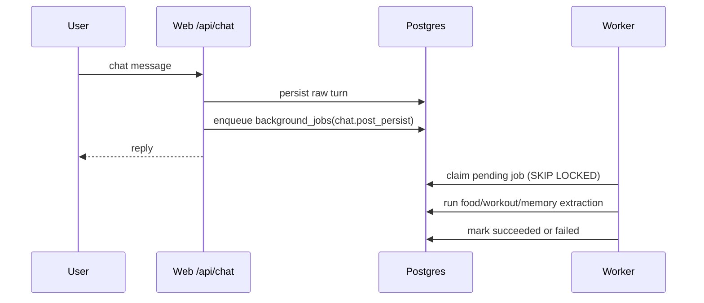
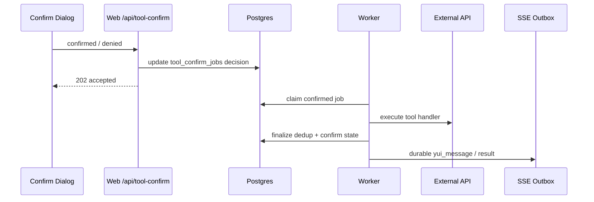
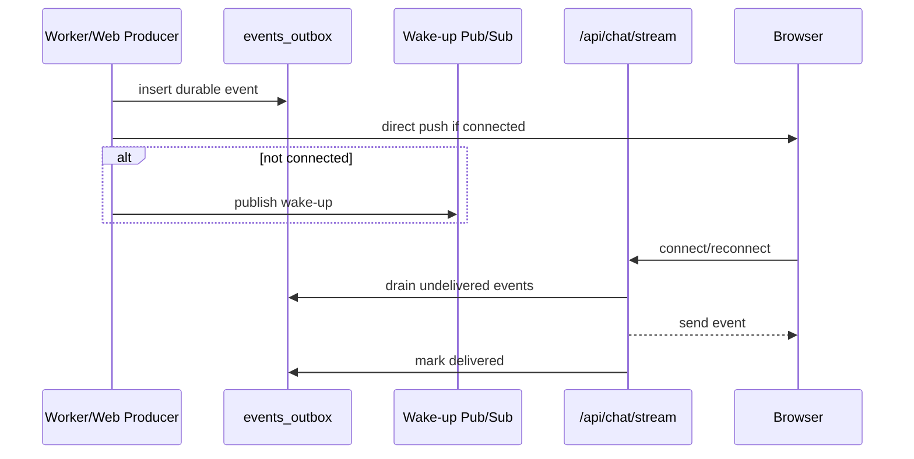

# Background Worker Implementation Report

Date: 2026-06-23

## Summary

Web hot path から scheduler / maintenance / specialist job / confirm Phase B / post-persist extraction / selected heavy helper jobs を分離し、plain `tsx` worker process に移した。

主目的は以下。

- Next dev server の HMR / compile / request lifecycle に background processing を巻き込まない
- user turn 中の proactive 発話を queue し、会話への割り込みを抑制する
- SSE 未接続・Web再起動中でも user-facing result を durable outbox に残す
- worker crash 後に stuck job を recovery できるようにする
- Docker内で worker heartbeat / queue / periodic 状態を観測できるようにする

## Module Map

```mermaid
flowchart LR
  Browser[Browser / UI] --> Web[Next Web]
  Web --> ChatAPI[/api/chat]
  Web --> ConfirmAPI[/api/tool-confirm/:token]
  Web --> WorkerStatus[/api/worker/status]

  ChatAPI --> Raw[(raw_messages)]
  ChatAPI --> BJ[(background_jobs)]
  ChatAPI --> Outbox[(events_outbox)]
  ConfirmAPI --> ConfirmJobs[(tool_confirm_jobs)]

  Worker[worker process<br/>npm run worker] --> Scheduler[Scheduler Owner]
  Worker --> Maintenance[Maintenance Loop]
  Worker --> Specialist[Specialist Job Loop]
  Worker --> ConfirmExec[Confirm Execution Loop]
  Worker --> Jobs[Generic Background Job Loop]
  Worker --> Recovery[Recovery Loop]
  Worker --> Heartbeat[(worker_heartbeats)]

  Scheduler --> Periodic[(periodic_state)]
  Specialist --> Tasks[(tasks)]
  Specialist --> Outbox
  ConfirmExec --> ConfirmJobs
  ConfirmExec --> Outbox
  Jobs --> BJ
  Jobs --> Memory[(memory_chunks / food_logs / workout_logs / mail)]
  Recovery --> BJ
  Recovery --> ConfirmJobs
  Recovery --> Tasks

  Outbox --> SSE[/api/chat/stream]
  SSE --> Browser
  WorkerStatus --> Heartbeat
  WorkerStatus --> BJ
  WorkerStatus --> Periodic
```

## Main Sequences

### Chat Post-persist Jobs



### Confirm Phase B



### Durable Outbox



## Current Job Stores

- `tasks`: specialist task domain state and report output.
- `tool_confirm_jobs`: confirm pending/decision/execution state.
- `background_jobs`: generic worker queue for post-persist and helper jobs.
- `events_outbox`: durable delivery queue for user-facing SSE events.
- `worker_heartbeats`: worker liveness.
- `periodic_state`: scheduler module last run / fired state.

## Recovery Policy

- `background_jobs.running`: retry by returning to `pending` if attempts remain.
- `background_jobs.running` max attempts exceeded: mark `failed`.
- `tool_confirm_jobs.running`: mark `failed`; do not auto replay external mutation.
- `tasks.specialist_query.running`: mark `failed`; do not auto replay to avoid duplicate speech / side effects.

## Observability

Commands:

```bash
docker compose exec -T web npm run observe:worker
docker compose exec -T web npm run observe:tools
docker compose exec -T web npm run health:tools
```

HTTP:

```bash
GET /api/worker/status
```

The endpoint returns worker heartbeat, queue summary, confirm summary, specialist task summary, outbox pending counts, and periodic state.

## Remaining Work

- Manual mail poll / fetch bodies job migration.
- Explicit `diary.write` job handler split, if scheduler direct execution becomes too opaque.
- Spotify polling heavy follow-up split.
- Transactional enqueue between raw message persist and `chat.post_persist` job.
- Real UI smoke test for image summary / music prefetch / mail curate.
