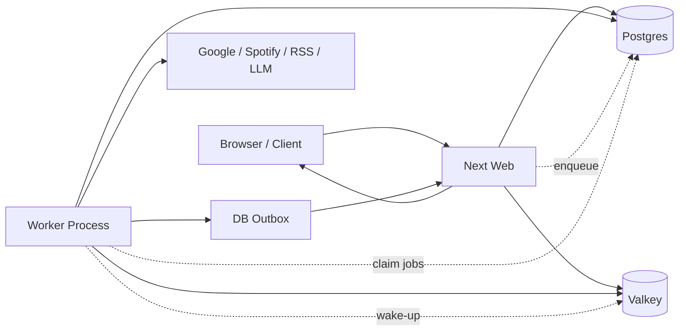

# Background Worker Refactor Plan

> ステータス: 実行計画  
> 作成日: 2026-06-23  
> 対象: scheduler / periodic modules / chat post-persist jobs / specialist jobs / confirm execution / notification delivery  
> 関連:
> - [dev-memory-restart-investigation.md](./dev-memory-restart-investigation.md)
> - [tool-refactor-plan.md](./tool-refactor-plan.md)
> - [tool-use-implementation-report.md](./tool-use-implementation-report.md)
> - [tool-crash-recovery-reconciliation.md](./tool-crash-recovery-reconciliation.md)

## 0. 目的

現在の Web プロセスは、ユーザーからの HTTP リクエスト処理に加えて、次のような背景処理も抱えている。

- `/api/chat` の先頭で `tickMaintenance()` が起動する
- `tickMaintenance()` が scheduler を初期化する
- scheduler が periodic module を `setInterval` で実行する
- chat 保存後に food / workout / memory / image summary を fire-and-forget で起動する
- specialist job と confirm 後の tool execution が Web プロセス内で background 実行される

この構造では、リロード後や時間経過後の初回チャットでニュース・メール・maintenance がまとめて動き、初回操作の遅延、画面フラッシュ、予期しない自発発話、Next dev のメモリ圧を引き起こしやすい。

ただし、Next dev の cold compile による初回 route / modal 読み込み遅延は本計画の直接対象外とする。prewarm、production-like dev、`init: true`、Next dev 設定の見直しは別トラックで扱う。本計画で解くのは、Web request に background work が同居することによる遅延・混線・メモリ圧である。

本計画の目的は、**Web プロセスをユーザー操作の受付と即時応答に集中させ、定期処理・重い非同期処理・外部 API 副作用を worker に分離すること**である。

## 1. 基本方針

1. Web は request / response と SSE 接続を担当する。
   ユーザーの入力受付、認証、入力検証、即時応答、UI 用 read API は Web に残す。

2. Worker は時間起点・ジョブ起点の副作用を担当する。
   periodic、chat 後処理、confirm 後実行、specialist 実行、batch cleanup は worker に移す。

3. 状態は DB を source of truth にする。
   worker と Web の境界を超える状態は、in-memory flag ではなく Postgres / Valkey に置く。

4. SSE 配送は durable outbox を正本にして cross-process 化する。
   worker が別プロセスになると、現在の in-memory push だけでは Web クライアントへ届かない。ユーザー向け通知・tool 結果・job 結果は DB outbox に永続化し、Valkey pub/sub は Web を起こすための低遅延 wake-up signal としてだけ使う。

5. 既存の tool correctness を壊さない。
   Tool Gate / Executor / dedup / confirm / reporter の意味論は維持し、実行場所だけを段階的に移す。

6. 新しい worker job を追加しやすい形にする。
   個別機能ごとに ad hoc な `setInterval` / fire-and-forget / `void run()` を増やさず、job registry と handler interface に集約する。

7. Worker の責務は「起動場所」ではなく「実行モデル」で分類する。
   定期実行、即時 enqueue、遅延実行、確認後実行、再試行付き実行を同じ基盤で扱えるようにする。

8. Enqueue は依存元の DB 更新と同一トランザクションで行う。
   chat 保存後 job、confirm decision 後 job、tool outcome event などは、元データの write と job / outbox append を atomic にする。

9. Scheduler の owner は worker のみに固定する。
   Web から scheduler 起動コードを削除し、worker 側でも `pg_try_advisory_lock` で単一 owner を保証する。

10. Worker は Next.js dev server を使わない。
   worker は `tsx` / plain Node process として起動し、webpack / HMR / Next dev watcher のメモリ増加を持ち込まない。

## 1.1 Worker Job 拡張設計

今後もバックグラウンド処理は増えるため、worker は機能別の直書きではなく、以下のような拡張可能な構造にする。

```ts
type WorkerJobType =
  | "periodic.tick"
  | "tool.confirm.execute"
  | "specialist.run"
  | "memory.extract"
  | "memory.reconcile"
  | "food.extract"
  | "food.nutrition_fill"
  | "workout.extract"
  | "image.summarize"
  | "music.trivia_prefetch"
  | "mail.poll"
  | "mail.curate"
  | "news.fetch"
  | "diary.write";

type WorkerJobHandler<TPayload> = {
  type: WorkerJobType;
  concurrency: number;
  timeoutMs: number;
  retry: {
    maxAttempts: number;
    backoffMs: number;
  };
  run: (job: {
    id: string;
    payload: TPayload;
    attempt: number;
    signal: AbortSignal;
  }) => Promise<void>;
};
```

設計原則:

- 新しいバックグラウンド機能は `handlers/<domain>/<job>.ts` を追加し、registry に登録するだけで動くようにする。
- job payload は JSON schema / zod で validate する。
- handler は Web の request object / React / Next route に依存しない。
- handler は必ず idempotency key または dedup key を受け取れるようにする。
- handler は user-facing event を直接 SSE に書かず、durable outbox に append する。
- handler は例外を握りつぶさず、`background_jobs.last_error` に残す。
- 定期実行も「scheduler が handler を直接呼ぶ」のではなく、必要なら `periodic.tick` または domain job を enqueue する。

### Transactional Enqueue

job / outbox は、原因となる DB 更新と同一 transaction で作成する。

例:

- chat message insert + `food.extract` enqueue
- chat message insert + `memory.extract` enqueue
- image insert + `image.summarize` enqueue
- confirm decision update + `tool.confirm.execute` enqueue
- tool execution log update + durable outbox append
- specialist task insert + worker job enqueue

禁止する形:

```ts
await saveChatMessage();
void enqueueFoodExtract();
```

採用する形:

```ts
await db.transaction(async (tx) => {
  await saveChatMessage(tx);
  await enqueueJob(tx, {
    type: "food.extract",
    dedupKey,
    payload,
  });
});
```

これにより、DB 更新後にプロセスが落ちて job だけ失われる、または job だけ作られて依存元データが存在しない、という窓を閉じる。

### Job Store 方針

終状態では、実行待ちの汎用 background job は `background_jobs` に寄せる。

ただし既存の意味を持つテーブルは残す。

- `tasks`: specialist のユーザー可視タスク状態・report 保存先として残す
- `tool_execution_log`: tool dedup / reservation / execution audit として残す
- `background_jobs`: worker の claim / retry / scheduling / handler dispatch を担う
- `events_outbox`: user-facing event の durable delivery を担う

つまり `tasks` / `tool_execution_log` はドメイン状態、`background_jobs` は実行制御、`events_outbox` は配送制御と分ける。

W5/W6 の移行では、既存 `tasks` / `tool_execution_log` を job store に無理やり統合せず、それぞれから `background_jobs` を transactional enqueue する。

### Worker Scope

本アプリは単一ユーザー常用を主対象にするため、Sidekiq のような汎用ジョブ基盤を作り込まない。

MVP で必要な機能:

- `background_jobs`
- `FOR UPDATE SKIP LOCKED` claim
- `status`
- `attempt`
- `max_attempts`
- `next_run_at`
- `last_error`
- `dedup_key`
- `locked_at`
- `locked_by`

後回しにする機能:

- 複雑な dead-letter UI
- 大規模 queue dashboard
- 動的 concurrency tuning
- multi-tenant quota

ただし handler registry は最初から入れる。job 種別追加のコストを下げる効果が大きく、過剰実装ではないため。

推奨ディレクトリ構成:

```text
src/worker/
  index.ts
  loop.ts
  registry.ts
  jobs.ts
  locks.ts
  events.ts
  handlers/
    periodic/
    tool/
    specialist/
    memory/
    food/
    workout/
    image/
    music/
    mail/
    news/
    diary/
```

`src/worker/handlers/diary/write.ts` のように、日記も他の background job と同じ handler 形式にする。

## 2. ワーカー化対象

### 2.1 Scheduler / Periodic

最優先で Web から外す。

- `src/lib/scheduler.ts`
- `src/periodic/calendar-check.ts`
- `src/periodic/reminder-dispatch.ts`
- `src/periodic/news-fetch.ts`
- `src/periodic/mail-poll.ts`
- `src/periodic/morning-check.ts`
- `src/periodic/diary-write.ts`
- `src/periodic/memory-decay.ts`
- `src/periodic/memory-cleanup.ts`
- `src/periodic/profile-snapshot.ts`
- `src/periodic/tool-exec-cleanup.ts`

### 2.2 Maintenance

`/api/chat` 起点から外し、worker boot または worker periodic job に移す。

- `processStaleSessions`
- `pruneExpiredAttachments`
- `pruneOldNews`
- `rearmAllPending`
- `releaseStuckProcessing`
- `kickFillWorker`
- OAuth token migration
- TTS dictionary seed
- model registry migration

### 2.3 Chat Post-persist Jobs

チャット保存後の fire-and-forget を queue 化する。

- `scheduleExtract` / food extraction
- `kickNutritionFill` / nutrition fill
- `scheduleWorkoutExtract`
- `extractIncremental`
- `reconcileNewChunks`
- `summarizeUserImageBg`

`quickSaveExplicitMetrics()` は軽量かつ同ターン参照に必要なため Web に残す。

### 2.4 Tool / Specialist Jobs

外部 API 副作用・LLM report・confirm 後実行を worker に移す。

- `dispatchSpecialistJob` / `runJob`
- `executePendingTool`
- confirmed destructive / mutation tool execution
- tool reconciliation dry-run / health check の定期化

### 2.5 External / Heavy Auxiliary Jobs

重い外部連携は worker に寄せる。

- Gmail poll / curate / fetch bodies
- News fetch / curate / speech
- Music trivia prefetch
- Spotify now-playing polling の重い後続処理

## 3. 非対象

以下は Web に残す。

- `/api/chat` の受付、認証、入力検証
- メイン LLM の即時応答
- Tool Gate / Executor の同期判断
- UI の read API
- SSE endpoint
- 軽量 status API
- `quickSaveExplicitMetrics()`

ただし SSE endpoint は Web に残すが、worker からの user-facing publish は durable outbox 経由にする。

## 4. 目標アーキテクチャ



原則:

- enqueue は Web でも worker でも可能
- claim / execute は worker が担当
- user-facing event は worker から DB outbox へ append
- Valkey pub/sub は Web SSE の即時 drain を促す wake-up signal に限定
- Web は SSE 接続時・wake-up 受信時・定期 polling で outbox を drain し、SSE へ流す

## 4.1 Event Delivery Semantics

worker 分離後のイベント配送は、用途ごとに配送保証を分ける。

### Durable event

DB outbox を必須とする。Web 再起動中、SSE 未接続、ブラウザ未表示でも消えてはいけない。

- confirm 後の tool execution result
- specialist job result
- リマインダー通知
- カレンダー通知
- メール重要通知
- ニュース発話として残すべき通知
- diary / memory / food / workout など、ユーザーに結果表示する job completion
- assistant message として保存・表示される発話
- error / recovery warning

### Ephemeral event

消えても correctness に影響しないものだけ Valkey pub/sub 単独を許可する。

- now-playing の live state
- progress spinner の瞬間的な更新
- debug-only trace
- 再接続後に DB から復元できる status の wake-up

### Outbox Schema 方針

`events_outbox` は少なくとも次を持つ。

```text
id
session_id
event_type
payload
dedup_key
created_at
available_at
delivered_at
expires_at
priority
source_job_id
```

設計ルール:

- worker は user-facing event を必ず outbox に insert してから wake-up signal を publish する。
- Web は SSE 接続時に `delivered_at is null` または cursor 以降の event を drain する。
- delivery marking は session / client policy を明示する。
  単一ブラウザ前提なら `delivered_at` でよい。複数 client を正式対応するなら `event_deliveries(event_id, client_id)` を追加する。
- `dedup_key` で同一 job result の二重表示を抑止する。
- pub/sub は outbox を読むきっかけであり、配送保証を担わない。

## 5. フェーズ計画

### Phase W1: Worker Entry Point と Docker Service の追加

ステータス: 完了

目的:
worker プロセスを起動できる土台を作る。まだ既存処理は移さない。worker は Next.js dev server ではなく、plain Node / `tsx` で起動する。

実装:

- `scripts/worker.ts` または `src/worker/index.ts` を追加
- `npm run worker` を追加
- `docker-compose.yml` に `worker` service を追加
- Web と同じ env / volume / DB / Valkey に接続
- worker boot log と graceful shutdown を実装
- worker heartbeat を DB に書く
- Web health / debug endpoint から worker heartbeat の鮮度を確認できるようにする

完了条件:

- `docker compose up -d worker` で worker が起動する
- worker が DB / Valkey に接続できる
- worker が Next / webpack / HMR を起動していない
- heartbeat が更新される
- Web の既存挙動は変わらない

期待効果:

- worker は HMR watcher を持たないため、Web dev server のメモリ肥大を持ち込まない
- W2 以降、periodic / mail / news / specialist などの RSS が Web から worker に移り、Web コンテナのメモリ圧低下が期待できる
- 実測値は W2/W3/W5 後に `docker stats` と cgroup `memory.current` で記録する

テスト:

```bash
docker compose exec -T web npm run typecheck
docker compose exec -T web npm run lint
docker compose up -d worker
docker compose logs --tail 100 worker
```

Rollback:

- `worker` service を停止しても Web の既存挙動は変わらない
- このフェーズでは既存処理を移さない

実装メモ:

- `worker_heartbeats` を追加
- `npm run worker` を追加
- `docker-compose.yml` に `worker` service を追加
- `/api/worker/status` を追加
- worker は `tsx src/worker/index.ts` で起動し、scheduler / maintenance はまだ起動しない

### Phase W2: Scheduler を Worker へ移動

ステータス: 完了

目的:
`/api/chat` から scheduler 起動を外し、periodic を worker 常駐にする。

実装:

- worker boot で `startScheduler()` を呼ぶ
- `/api/chat` の `tickMaintenance()` から `startScheduler()` 呼び出しを削除する
- Web では scheduler を二度と起動しない
- worker が scheduler の唯一の owner になる
- worker 側で `pg_try_advisory_lock` による scheduler singleton lock を取得する
- lock を取れない worker は scheduler を起動せず standby とする
- periodic module の `lastRunAt` / `lastFiredAt` は現行 DB state を維持

完了条件:

- Web 起動後にチャットしても scheduler registration log が出ない
- Worker 起動時に scheduler registration log が出る
- worker を2つ起動しても scheduler owner は1つだけになる
- periodic modules は worker 側で継続実行される
- worker heartbeat が stale になった場合、Web health / debug で検知できる

テスト:

```bash
docker compose logs --since 5m web
docker compose logs --since 5m worker
docker compose exec -T web npm run typecheck
docker compose exec -T web npm run lint
```

手動確認:

- リロード直後にチャットしてもニュース・メール初回処理が同時起動しない
- `periodic_state.last_run_at` が worker により更新される

Rollback:

- `WORKER_SCHEDULER_ENABLED=0` で worker scheduler を止められるようにする
- 緊急時のみ `WEB_LEGACY_SCHEDULER_ENABLED=1` で旧 Web scheduler を戻せる feature flag を用意する
- rollback flag は一時用途で、安定後に削除候補とする

実装メモ:

- Web の `tickMaintenance()` はデフォルトでは scheduler を起動しない
- `WEB_LEGACY_SCHEDULER_ENABLED=1` の場合のみ、緊急 rollback として Web scheduler を起動可能
- worker が `pg_try_advisory_lock(hashtextextended(...))` を専用 reserved connection で保持し、取得できた worker だけ `startScheduler()` を呼ぶ
- `WORKER_SCHEDULER_ENABLED=0` で worker scheduler を停止可能
- 2つ目の worker プロセスは `standby: scheduler lock is held by another worker` になり、scheduler owner にならないことを確認済み

### Phase W2.5: Proactive 発話の Turn-aware Queue

ステータス: 完了

目的:
正規の periodic / reminder / news / calendar 発火が、ユーザーの会話ターン中に割り込んで発話することを防ぐ。

背景:
W2 により「チャット開始時に scheduler が初回登録され、news / mail / maintenance が雪崩れる」問題は止まる。
しかし、worker 側で scheduler が正しく動いていても、reminder-dispatch / calendar-check / news-fetch がユーザーの会話中に発火すれば、別の発話が同じ UI ターンへ混ざる。
これは scheduler の owner 問題ではなく、**proactive 発話タイミングの所有者がいない**ことが原因である。

実装:

- session ごとに user turn / assistant turn / tool turn の active 状態を判定できる軽量 state を持つ
- proactive 発話は、active turn 中は即時 `/api/chat source=cron` せず、`proactive_speech_queue` または `events_outbox` に遅延保存する
- active turn が終わった後、idle window に入ったら順番に drain する
- reminder のような時刻厳守通知は notification 自体を durable outbox に即時保存し、音声発話だけを idle まで遅延可能にする
- 同一 session の proactive 発話は priority / created_at 順に直列化する
- 古くなった news などは expire 可能にし、reminder / calendar は expire させない

完了条件:

- ユーザーがチャット中に reminder / news / calendar が発火しても、会話応答の途中へ発話が割り込まない
- reminder / calendar の通知自体は失われない
- idle 後に必要な proactive 発話が順序通り表示される
- debug report または log で `queued_due_to_active_turn` が確認できる

テスト:

```bash
docker compose exec -T web npm run typecheck
docker compose exec -T web npm run lint
```

手動確認:

- 長めのチャット応答中に reminder を due にする
- 返答中に別発話が混ざらない
- 返答完了後に reminder 通知 / 発話が表示される
- news / calendar でも同じ挙動を確認する

Rollback:

- `PROACTIVE_TURN_QUEUE_ENABLED=0` で旧即時発話へ戻せる
- durable notification は残し、音声発話 queue のみ無効化できるようにする

実装メモ:

- `proactive_speech_queue` を追加
- `proactive_state` に `turn:<sessionId>` を保存し、user turn の active / finished を管理
- scheduler の `firePromptToYui()` は active turn 中なら `/api/chat source=cron` を即時実行せず queue する
- `dispatchNotification()` の auto speak は active turn 中なら `yui_message` を即時 push せず queue する
- `/api/chat` は user turn 開始時に active、終了時に inactive にし、終了後に queue を drain する
- reminder / calendar / news などの通知保存・toast は維持し、音声発話だけ遅延する
- 検証用 session で `queued true` / `drained 1` を確認し、テストデータは削除済み

### Phase W3: Maintenance の Web 起点撤去

ステータス: 完了

目的:
`tickMaintenance()` をチャット hot path から外す。

実装:

- worker boot job:
  - OAuth token migration
  - TTS dictionary seed
  - model registry migration
  - `rearmAllPending`
  - `releaseStuckProcessing`
- worker periodic maintenance:
  - `processStaleSessions`
  - `pruneExpiredAttachments`
  - `pruneOldNews`
  - `kickFillWorker`
- `/api/chat` から `tickMaintenance()` を削除、または軽量 health-only に縮小

完了条件:

- `/api/chat` の開始時に `[startup] running first maintenance pass` が出ない
- リロード後の初回チャット latency が maintenance に引きずられない
- stale session / prune / fill worker は worker logs で確認できる
- worker heartbeat stale 時に maintenance 停止を検知できる

テスト:

```bash
docker compose exec -T web npm run typecheck
docker compose exec -T web npm run lint
docker compose logs --since 10m web
docker compose logs --since 10m worker
```

DB 確認:

```sql
select module_id, last_run_at, last_fired_at
from periodic_state
order by module_id;
```

Rollback:

- `WORKER_MAINTENANCE_ENABLED=0` で worker maintenance を止める
- 緊急時のみ `WEB_LEGACY_MAINTENANCE_ENABLED=1` で旧 `tickMaintenance` を戻せる

実装メモ:

- `tickMaintenance()` は通常 `WEB_LEGACY_MAINTENANCE_ENABLED=0` で即 return する
- worker が `pg_try_advisory_lock(hashtextextended(...))` を専用 reserved connection で保持し、取得できた worker だけ maintenance loop を実行する
- worker boot maintenance:
  - `loadLocationFromDb`
  - `rearmAllPending`
  - OAuth token migration
  - TTS dictionary seed
  - model registry migration
  - food nutrition stuck release / kick
- worker periodic maintenance:
  - `processStaleSessions`
  - `pruneExpiredAttachments`
  - `pruneOldNews`
  - food nutrition kick
- worker 起動ログで maintenance owner lock と boot maintenance 実行を確認済み
- Web 直近ログに `[startup] running first maintenance pass` / prune / stale session 系ログが出ないことを確認済み

### Checkpoint W3: Headline Symptom Evaluation

ステータス: 完了

目的:
W1-W3 と W2.5 の時点で、今回の主症状が消えているかを一度評価する。

評価対象:

- リロード直後の初回チャットで scheduler / news / mail / maintenance が Web hot path に乗らない
- ユーザー会話中に proactive 発話が割り込まない
- worker heartbeat が正常に更新される
- periodic_state が worker により更新される
- Web コンテナの RSS が W2 前より下がる、または少なくとも background work 由来の増加が worker 側へ移る

テスト:

```bash
docker compose logs --since 10m web
docker compose logs --since 10m worker
docker stats --no-stream yui-agent-web yui-agent-worker
docker compose exec -T web npm run typecheck
docker compose exec -T web npm run lint
```

判定:

- この checkpoint が通るまでは W4 以降へ進まない
- 未解決なら、W4 以降の大きな worker 分離に進む前に原因を切り分ける

評価結果:

- 直近 Web log に `[startup] running first maintenance pass` / `[scheduler] registered` / prune / stale session 系ログが出ないことを確認
- `tickMaintenance()` 単体呼び出しでも通常設定では no-op になることを確認
- worker log で scheduler owner lock / maintenance owner lock / boot maintenance 実行を確認
- `periodic_state` は worker により更新中
- worker heartbeat は stale なし
- `proactive_speech_queue` は pending 0
- メモリ実測: web 約 2.08 GiB、worker 約 102 MiB


### Phase W4: Durable Outbox + Cross-process Wake-up

ステータス: 完了

目的:
worker から発生した通知、job status、assistant message を、Web 再起動や SSE 未接続をまたいで Web の SSE に届ける。

実装:

- `events_outbox` を追加
- worker 側 `appendEvent()` を追加
- Web SSE 側で outbox drain を実装
- Valkey pub/sub は `events_outbox` drain の wake-up signal として使う
- 既存 `pushToSession` / job status push を durable outbox + wake-up 経由に寄せる
- in-memory path は同一プロセス用 fallback として残す
- outbox append は原因となる状態更新と同一 transaction で行う

完了条件:

- worker から append した durable event がブラウザ SSE に届く
- Web 再起動中に作成された durable event が、再接続後に表示される
- SSE 未接続中に作成された durable event が、次回接続時に drain される
- pub/sub が落ちても polling / reconnect で outbox が drain される
- Discord forward など既存通知経路が壊れない

テスト:

```bash
docker compose exec -T web npm run typecheck
docker compose exec -T web npm run lint
```

手動確認:

- worker からテスト通知を outbox append
- Web UI に通知または debug event が表示される
- SSE 接続中に Web だけ再起動し、復帰後に未配送 event が表示される
- ブラウザを閉じた状態で worker event を作成し、再オープン時に表示される

Rollback:

- `OUTBOX_EVENTS_ENABLED=0` で旧 in-memory path に戻せる
- worker 化済みの user-facing result は outbox が前提になるため、W5/W6 に進む前に W4 rollback 手順を確認する

実装メモ:

- `events_outbox` を追加
- `pushDurableToSession()` を追加
  - outbox append
  - 同一プロセスの SSE subscriber がいれば即時 push
  - 即時 push できた場合は `delivered_at` を更新
  - subscriber がいなければ Valkey pub/sub wake-up を publish
- SSE endpoint は接続時と wake-up 受信時に outbox を drain する
- `dispatchNotification()` の toast / speak / Discord forward を durable outbox 経由に変更
- source=`cron` / `timer` の chat reply push を durable outbox 経由に変更
- W2.5 の queued notification speak drain も durable outbox 経由に変更
- 単体確認:
  - SSE 未接続で `pushDurableToSession()` → outbox 保存
  - `drainOutboxForSession()` → event 送信・`delivered_at` 更新
- SSE確認:
  - 未配送 event をDBに作成
  - `/api/chat/stream` 接続時に event 受信
  - `delivered_at` 更新を確認
- テスト用 outbox / session データは削除済み

### Phase W5: Specialist Job Runner の Worker 化

状態: **完了** (2026-06-23)

目的:
`tasks` に保存された specialist job を worker が claim / execute する。

実装:

- `dispatchSpecialistJob` は `tasks` への pending insert のみにする
- W7 の汎用 `background_jobs` 導入までは、`tasks` 自体を specialist queue として扱う
- task insert と queue 作成は同一 row なので transactional enqueue 窓を作らない
- worker が pending task を `FOR UPDATE SKIP LOCKED` で claim
- `runSpecialist` / `generateReport` / `formatInYuiVoice` を worker で実行
- result / report / yui_message は durable outbox 経由で Web へ
- stuck running task recovery は W9 で worker reconciliation に統合
- `WEB_LEGACY_SPECIALIST_RUNNER_ENABLED=1` の時だけ旧 Web 内 `runSpecialistJob()` を fire-and-forget する

完了条件:

- Web は `void runJob()` しない
- specialist job を worker が claim する
- UI には従来通り ack / report / final voice が出る

テスト:

```bash
docker compose exec -T web npm run typecheck
docker compose exec -T web npm run lint
docker compose exec -T web npm run eval:tools
docker compose exec -T web npm run eval:tool-orchestrator-llm
```

手動確認:

- カレンダー検索など specialist job を発生させる
- 二重報告が出ない
- `tasks.status` が `succeeded` になる

実施済み確認:

- `docker compose config --quiet`: OK
- `docker compose exec -T web npm run typecheck`: OK
- `docker compose exec -T web npm run lint`: OK
- worker 再作成後、`[worker:specialist] loop started poll=2000ms` を確認
- テスト用 `specialist_query` task を投入し、worker が `claimed task` して `failed` に畳むことを確認
- テスト用 `tasks` / `events_outbox` / `raw_messages` は削除済み

Rollback:

- `WORKER_SPECIALIST_ENABLED=0` で worker claim を止める
- `WEB_LEGACY_SPECIALIST_RUNNER_ENABLED=1` で旧 `void runJob()` 経路を一時復帰できる

### Phase W6: Confirm Phase B / Tool Execution の Worker 化

状態: **実装完了 / 手動実ツール確認待ち** (2026-06-23)

目的:
確認後の destructive / mutation execution を Web から分離する。

実装:

- confirm API は user decision を保存し、execution job を enqueue
- `tool_confirm_jobs` を追加し、pending confirm のDB正本兼 confirmed 後の execution queue として使う
- confirm decision update と execution queue 状態遷移は同一 `tool_confirm_jobs` row で扱う
- worker が confirmed confirm job を `FOR UPDATE SKIP LOCKED` で claim
- `executePendingTool` を worker で実行
- `UnifiedToolOutcome` / dedup reservation / reporter の意味論は維持
- final voice / report は durable outbox 経由で配信
- `executePendingTool` は Valkey cache が消えていても `tool_confirm_jobs.pending` から confirmed pending を復元できる
- `WEB_LEGACY_CONFIRM_EXECUTION_ENABLED=1` の時だけ旧 Web 内 `executePendingTool()` を fire-and-forget する

完了条件:

- confirm API は実ツールを直接実行しない
- 予定削除・メール送信などは確認後に worker で実行される
- confirm window 中の再起動後も pending が復旧できる

テスト:

```bash
docker compose exec -T web npm run eval:tool-confirm-phaseb
docker compose exec -T web npm run check:tool-integration
docker compose exec -T web npm run typecheck
docker compose exec -T web npm run lint
```

手動確認:

- 予定削除で確認ダイアログが出る
- 許可後に worker が実行する
- 拒否時に実行されない
- Web 再起動後の pending confirm が壊れない

実施済み確認:

- migration `0078_tool_confirm_jobs.sql` 適用済み
- `docker compose config --quiet`: OK
- `docker compose exec -T web npm run typecheck`: OK
- `docker compose exec -T web npm run lint`: OK
- worker 再作成後、`[worker:confirm] loop started poll=1000ms` を確認
- `tool_confirm_jobs` に残ジョブがないことを確認

未実施:

- 実UIで予定削除/作成の確認ダイアログを許可し、worker log に `claimed token` が出てDB status が `executed` になること
- Web再起動を挟んだ pending confirm 復旧確認

Rollback:

- `WORKER_CONFIRM_EXECUTION_ENABLED=0` で worker confirm execution を止める
- `WEB_LEGACY_CONFIRM_EXECUTION_ENABLED=1` で旧 Phase B 実行を一時復帰できる

### Phase W7: Chat Post-persist Jobs の Queue 化

状態: **部分完了** (2026-06-23)

目的:
food / workout / memory / image summary を Web request から切り離す。

実装:

- 汎用 `background_jobs` table を追加
- `chat.post_persist` job type を追加
- chat persistence は raw message 保存成功後に job enqueue する
- worker が job type ごとに handler 実行
- job retry / failed / last_error を記録
- `quickSaveExplicitMetrics()` は Web に残す
- `chat.post_persist` handler は food extraction / workout extraction / memory incremental extraction / memory reconcile を実行
- image summary は base64 payload が重いため W8 の external heavy job として分離予定
- nutrition fill は既に worker maintenance から kick されるため、この phase では post-persist queue へ統合しない

対象:

- food extraction: 完了
- workout extraction: 完了
- memory incremental extraction: 完了
- memory reconcile: 完了
- nutrition fill: W3 maintenance 起点のまま
- image summary: W8へ持ち越し

完了条件:

- chat route から post-persist food / workout / memory の inline 実行が消える
- food / workout / memory は worker logs で実行確認できる
- job failure が DB に残る

テスト:

```bash
docker compose exec -T web npm run typecheck
docker compose exec -T web npm run lint
docker compose exec -T web npm run check:tool-model
```

手動確認:

- 食事発話後に food log が作成される
- 運動発話後に workout log が作成される
- セッション終了または閾値到達後に memory chunk が作成される
- 画像添付後に summary が作成される

実施済み確認:

- migration `0079_background_jobs.sql` 適用済み
- `docker compose config --quiet`: OK
- `docker compose exec -T web npm run typecheck`: OK
- `docker compose exec -T web npm run lint`: OK
- worker 再作成後、`[worker:jobs] loop started poll=1000ms` を確認
- テスト用 `chat.post_persist` job を投入し、worker が claim して `succeeded` にすることを確認
- テスト用 `background_jobs` 行は削除済み

残:

- raw message 保存と enqueue の同一 transaction 化
- image summary の worker job 化
- 実UIで食事/運動/セッション終了発話のDB反映確認

Rollback:

- `WORKER_BACKGROUND_JOBS_ENABLED=0` で worker claim を止める
- `WEB_LEGACY_POST_PERSIST_JOBS_ENABLED=1` で旧 fire-and-forget 経路を一時復帰できる
- 復帰時も transactional enqueue 済み job が二重実行されないよう、dedup key / status を確認する

### Phase W8: External Heavy Jobs の Queue 化

状態: **部分完了** (2026-06-23)

目的:
メール・ニュース・音楽 trivia・日記など、外部 API と LLM を使う重い補助処理を worker 経由に統一する。

実装:

- image summary を `image.summary` job に変更
- Music trivia prefetch を `music.prefetch_trivia` job に変更
- manual mail curate を `mail.curate` job に変更
- manual mail poll / fetch bodies は未移行
- news fetch / curate / speech は scheduler worker から実行済み
- diary write は scheduler worker から実行済み。`diary.write` handler 分離は未実施
- Spotify polling の重い後続処理は worker job に分離

完了条件:

- image summary / music prefetch / manual mail curate の失敗が `background_jobs` に残る
- Music trivia prefetch API は LLM / web search を待たずに 200 を返す
- Mail curate API は jobId を返し、LLM分類を待たない

テスト:

```bash
docker compose exec -T web npm run typecheck
docker compose exec -T web npm run lint
docker compose exec -T web npm run eval:tool-domains
```

手動確認:

- MusicModal を開いても `/` reload や重い server compile 以外の背景処理が増えない
- news fetch は worker logs にだけ出る
- mail poll は worker logs にだけ出る
- diary write は worker logs と DB 更新で確認できる

実施済み確認:

- `docker compose exec -T web npm run typecheck`: OK
- `docker compose exec -T web npm run lint`: OK
- worker 再作成後、`[worker:jobs] loop started poll=1000ms` を確認
- テスト用 `mail.curate` job を投入し、worker が claim して `succeeded` にすることを確認
- テスト用 `background_jobs` 行は削除済み

残:

- manual mail poll / fetch bodies の job 化
- diary write の明示 job handler 化
- Spotify polling の重い後続処理分離
- 実UIで画像添付 / music prefetch / mail curate の確認

Rollback:

- `WORKER_BACKGROUND_JOBS_ENABLED=0` で `background_jobs` worker claim を止める
- 手動 API は必要に応じて同期実行へ一時復帰できる
- 機能別 flag (`WORKER_MAIL_ENABLED` / `WORKER_MUSIC_ENABLED` 等) は未実装。必要になった時点で追加する

### Phase W9: Crash Recovery / Reconciliation の Worker 統合

状態: **完了** (2026-06-23)

目的:
worker 分離後の中断・再起動・stuck job を回復できるようにする。

実装:

- pending / running jobs の timeout policy
- retry count / next_run_at / last_error
- `background_jobs` の stale `running` は retry 可能なら `pending` に戻す
- `background_jobs` が max attempts 超過なら `failed` にする
- confirm execution の stale `running` は二重外部実行を避けるため自動再実行せず `failed` にする
- confirm stale failed 時は dedup reservation も `failed` finalize する
- specialist task の stale `running` は二重発話/外部副作用を避けるため `failed` にする
- periodic module の in-flight recovery は advisory lock owner / periodic_state 方針のため追加なし
- reconciliation report は既存 dry-run CLI / eval を維持し、自動repairにはしない

完了条件:

- worker kill / restart 後に stuck job が検出される
- 二重実行せずに retry または warning 化される
- dry-run reconciliation は引き続き安全

テスト:

```bash
docker compose exec -T web npm run eval:tool-reconcile
docker compose exec -T web npm run reconcile:tools
docker compose exec -T web npm run health:tools
docker compose exec -T web npm run typecheck
docker compose exec -T web npm run lint
```

手動確認:

- worker 停止中に job を enqueue
- worker 再起動後に処理される
- 実行中 worker を再起動し、timeout 後に recovery される

実施済み確認:

- `docker compose exec -T web npm run typecheck`: OK
- `docker compose exec -T web npm run lint`: OK
- worker 再作成後、`[worker:recovery] loop started interval=60000ms` を確認
- stale `background_jobs.running` テスト行を作成し、`runRecoveryOnce()` で回収されることを確認
- recovered background job は `pending` 復帰後に worker が claim して `succeeded` になることを確認
- stale `tool_confirm_jobs.running` テスト行を作成し、`failed` へ倒れることを確認
- stale `tasks.specialist_query.running` テスト行を作成し、`failed` へ倒れることを確認
- テスト用 `background_jobs` / `tool_confirm_jobs` / `tasks` 行は削除済み

Rollback:

- `WORKER_RECOVERY_ENABLED=0` で自動 recovery を止める
- dry-run reconciliation / health check は残し、自動 retry だけ止められるようにする

### Phase W10: Observability / Final Cleanup

状態: **完了** (2026-06-23)

目的:
運用時に worker 側の状態を見えるようにし、旧 Web 起点コードを削除する。

実装:

- worker heartbeat は W1 で導入済み
- `observe:worker` CLI を追加
- `/api/worker/status` を queue / confirm / specialist / outbox / periodic summary 付きに拡張
- job metrics / queue depth / failure count を CLI と API で確認可能にする
- periodic last run は CLI と API で確認可能にする
- 実装レポート `docs/background-worker-implementation-report.md` を追加
- Web から未使用になった legacy path 削除は、feature flag 付き安定運用後の別作業に回す

完了条件:

- `observe` 系 script で worker / queue / periodic の状態が見える
- Web logs に scheduler / heavy job logs が出ない
- docs に最終アーキテクチャと運用手順がまとまっている

テスト:

```bash
docker compose exec -T web npm run check
docker compose exec -T web npm run check:tool-model
docker compose exec -T web npm run check:tool-integration
docker compose exec -T web npm run observe:tools
```

Rollback:

- cleanup で削除する legacy path は、W1-W9 が安定してから別コミットで行う
- final cleanup 前の commit に戻せば feature flag 付きの状態へ戻れる

実施済み確認:

- `docker compose exec -T web npm run typecheck`: OK
- `docker compose exec -T web npm run lint`: OK
- `docker compose exec -T web npm run observe:worker`: OK
- `/api/worker/status` が 200 を返し、`ok: true` と queue / periodic summary を返すことを確認

## 6. 横断テスト計画

### 6.1 自動テスト

各フェーズで最低限:

```bash
docker compose exec -T web npm run typecheck
docker compose exec -T web npm run lint
```

ツール実行系に触るフェーズ:

```bash
docker compose exec -T web npm run eval:tools
docker compose exec -T web npm run check:tool-model
docker compose exec -T web npm run check:tool-integration
```

外部 API を含む実 DB / 実 API テスト:

```bash
docker compose exec -T web npm run eval:tool-domains
docker compose exec -T web npm run eval:tool-domains:strict
```

### 6.2 手動シナリオ

最低限、以下を各大きなフェーズ後に確認する。

1. リロード直後に雑談する
   - scheduler / news / mail が Web logs に出ない
   - 予期しない自発発話が出ない

2. 予定を登録する
   - ack が出る
   - 実登録される
   - 二重報告が出ない

3. 予定を削除する
   - 確認ダイアログが出る
   - 拒否で実行されない
   - 許可で worker 実行される

4. リマインダーを登録する
   - due 時刻に worker から通知される

5. TODO / メモ / アドレス帳
   - add / search / update / delete の基本操作が通る

6. 食事 / 運動ログ
   - 会話から抽出される
   - nutrition fill が後続で実行される

7. MusicModal
   - 初回表示が重すぎない
   - trivia prefetch が Web にぶら下がらない

8. worker restart
   - pending job が失われない
   - stuck running が recovery 対象になる

### 6.3 DB 確認

代表クエリ:

```sql
select module_id, last_run_at, last_fired_at
from periodic_state
order by module_id;

select status, count(*)
from tasks
group by status
order by status;

select status, count(*)
from tool_execution_log
group by status
order by status;
```

`background_jobs` を導入した後:

```sql
select type, status, count(*), max(updated_at)
from background_jobs
group by type, status
order by type, status;
```

## 7. リスクと対策

| リスク | 対策 |
|---|---|
| worker と Web の二重実行 | DB advisory lock / SKIP LOCKED / singleton lock |
| SSE が worker から届かない | DB durable outbox を正本にし、Valkey pub/sub は wake-up signal に限定 |
| Web 再起動中に user-facing event が消える | outbox を接続時に drain し、`dedup_key` / cursor / `delivered_at` で二重表示を抑止 |
| enqueue と元データ write の間でクラッシュする | 元データ write、job enqueue、outbox append を同一 DB transaction にする |
| worker が死んで時刻厳守 dispatch が止まる | W1 から worker heartbeat を記録し、Web health / debug で stale を検知 |
| proactive 発話がユーザー会話へ割り込む | W2.5 で active turn 中の発話を queue し、idle window で drain |
| worker 停止中に通知が遅れる | job queue に保存し、再起動後に処理 |
| periodic の初回 catch-up が大量発火 | `lastRunAt` と rate limit を維持 |
| mutation が二重実行される | confirm execution job に idempotency key / reservation id を保持 |
| dev の Next compile と worker 問題が混ざる | Web logs と worker logs を分離 |
| 外部 API テストが環境依存 | strict / skip mode を分ける |

## 8. 完了条件

このリファクタリング全体の完了条件:

- `/api/chat` が scheduler / maintenance / heavy post jobs を直接起動しない
- periodic modules は worker でのみ実行される
- specialist job は worker が claim / execute する
- confirm Phase B は worker が execute する
- chat post-persist jobs は queue 経由で worker が処理する
- worker からの通知・job status・assistant message が UI に届く
- worker restart 後に pending / running job の recovery ができる
- 予定、リマインダー、TODO、メモ、アドレス帳、食事、運動、メール、ニュース、音楽の代表シナリオが通る
- `npm run check`, `npm run check:tool-model`, `npm run check:tool-integration` がコンテナ内で通る
