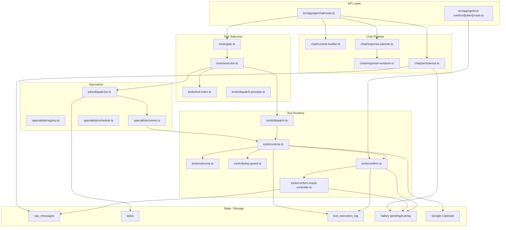
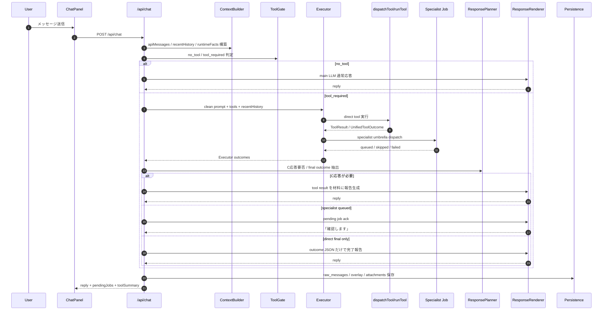
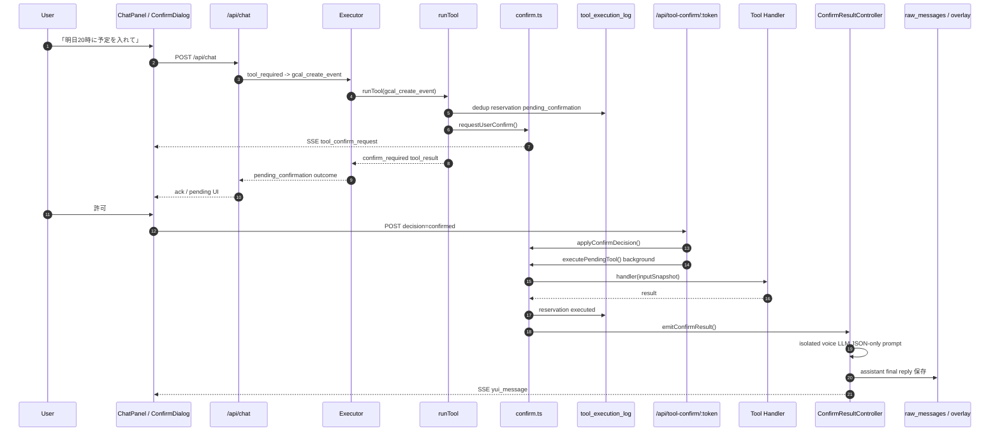
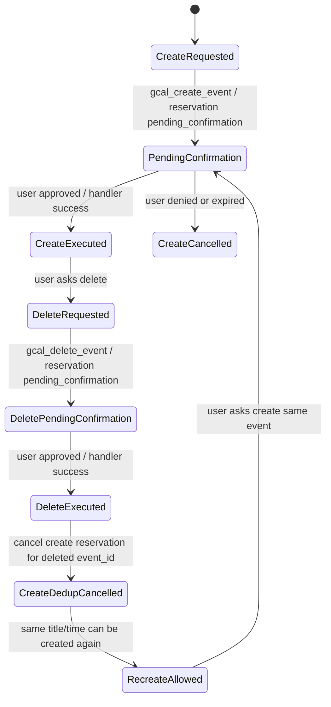
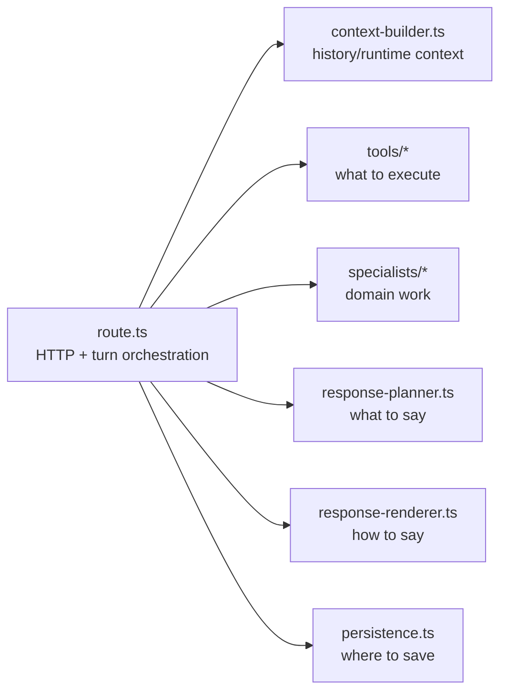

# Tool Execution Implementation Report

> ステータス: 実装レポート  
> 作成日: 2026-06-21  
> 対象: v0.2 以降の Tool Gate / Executor / specialist / confirm / dedup / response pipeline  
> 関連:
> - [tool-refactor-plan.md](./tool-refactor-plan.md)
> - [tool-agent-state-v6.md](./tool-agent-state-v6.md)
> - [tool-dispatch-redesign.md](./tool-dispatch-redesign.md)
> - [tool-dedup-and-adding-tools.md](./tool-dedup-and-adding-tools.md)

## 0. 概要

v0.2 以降、ツール利用のアーキテクチャは「会話LLMが直接 tool を持つ構成」から、**会話生成・ツール選択・ツール実行・最終報告を分離する構成**へ移行した。

この変更の目的は、ローカルLLMでも安全に動くツール実行基盤を作ることである。
特に Qwen / xLAM などのローカルモデルでは、人格プロンプトと tool schema を同時に渡すと、ツール呼び出しを構造化せず本文に漏らしたり、未実行なのに完了したように話す事故が起こりやすい。

現在の設計では、main LLM は原則として通常会話と最終報告だけを担当し、ツール選択は clean prompt の Executor、実行は `dispatchTool` / specialist / confirm controller が担当する。

## 1. 解決した主な問題

### 1.1 ツール結果前の事実誤答

以前は、ユーザーが「明日の予定を教えて」と言った時に、main LLM がツール結果を待たずに推測で返答することがあった。

現在は Tool Gate が `tool_required` と判定した場合、main の自由応答を抑制し、Executor / specialist の結果を待つ設計に寄せている。

### 1.2 confirmation 待ちの二重報告

以前は、予定作成や削除で confirm ダイアログを出した段階なのに、specialist voice が「登録しました」と言ってしまい、その後 confirm 後にも完了報告が出ることがあった。

現在は `pending_confirmation` を状態として扱い、確認待ちの段階では完了報告を出さない。
confirm 後は `ConfirmResultController` が isolated LLM call で1回だけ完了報告を生成する。

### 1.3 過去依頼の再実行

Executor には会話履歴を渡す必要がある。
一方で、履歴を渡すと過去の依頼を再実行するリスクがある。

現在は以下の二段構えで抑止している。

- Executor 入力履歴を直近ユーザー発話に絞る
- assistant の `toolSummary` を runtime facts に入れ、「直近で実行済み」と明示する
- 下流で `tool_execution_log` dedup guard をかける

### 1.4 削除後に再作成できない問題

予定を作成した後に削除しても、作成時の dedup log が `executed` のまま残ると、同じ予定を再作成できない。

現在は `gcal_delete_event` 成功時に、削除対象 event_id を作成した `gcal_create_event` の dedup reservation を `cancelled` にする。
これにより、削除済み予定の再作成が可能になる。

### 1.5 システムログや内部状態の会話混入

内部実行ログや debug report が会話本文に混ざる事故を避けるため、会話に出す内容、raw_messages に保存する内容、debug report に出す内容を分離している。

## 2. 現在の主要モジュール

## 3. 通常チャットの処理フロー

## 4. 確認付きツールの処理フロー

## 5. Google Calendar 作成・削除・再作成の状態遷移

## 6. 重要な状態データ

### 6.1 `tool_execution_log`

役割:
- mutation の reservation
- dedup 判定
- confirm token との紐付け
- 実行済み・キャンセル済みの監査

主な status:

| status | 意味 |
|---|---|
| `executing` | confirm 不要ツールの実行予約 |
| `pending_confirmation` | confirm 待ち |
| `executed` | 実行成功 |
| `skipped` | dedup / budget / duplicate などで未実行 |
| `failed` | 実行失敗 |
| `cancelled` | 拒否・期限切れ・削除後の作成dedup解除 |

### 6.2 `tasks.output`

specialist job と confirm final の状態を保存する。

主な用途:
- `state=pending_confirmation` を保持
- specialist outcomes を保持
- confirm final reply を保持
- create result の event_id を後から delete dedup解除に使う

### 6.3 `raw_messages.tool_summary`

次ターンで Executor に「直近で実行済み」と伝えるための軽量履歴。
これにより、履歴中の過去依頼を再実行する事故を減らす。

## 7. モジュール別ロジック

### 7.1 Tool Gate

入力:
- 最新ユーザー発話
- 直近ユーザー履歴
- runtime facts

出力:
- `no_tool`
- `tool_required`
- category: `chat` / `read` / `mutate` など
- wait policy

役割:
- 雑談は main LLM に流す
- ツール必須なら main の推測応答を止める

### 7.2 Executor

入力:
- clean system prompt
- 直近ユーザー履歴
- runtime facts
- retrieval 済み tool catalog

役割:
- tool_use だけを出す
- `no_tool` なら declined
- direct tool は `dispatchTool` へ
- specialist umbrella は bridge へ

重要:
- Executor は人格を持たない
- main LLM の ack を信用しない
- tool_result を読んで mini-loop する
- pending confirmation が出たらそこで停止する

### 7.3 dispatchTool / runTool

役割:
- ToolDef metadata の解決
- confirmation policy の適用
- dedup check
- handler 実行
- untrusted output wrap
- `UnifiedToolOutcome` 化

### 7.4 specialist

役割:
- schedule / mail / music などの専門処理
- background job として実行
- `tasks.output.state/outcomes` に結果を保存
- pending confirmation の場合は voice/report を出さない

### 7.5 ConfirmResultController

役割:
- confirm 承認/拒否/失敗後の最終報告を生成
- 通常会話履歴や env/memory を渡さず、input JSON だけで LLM に1文生成させる
- token 単位で final voice を1回だけ送る

### 7.6 ResponsePlanner / ResponseRenderer

役割:
- outcome から、今ユーザーに何を返すべきかを決める
- direct tool success / dedup skip / error / pending を整理する
- final voice は persona 付きだが、事実は outcome JSON だけに限定する

### 7.7 Persistence

役割:
- 画像保存
- private overlay 保存
- raw_messages 保存
- post-persist extraction

これにより route は保存先の詳細を知らなくてよくなった。

## 8. 現在の処理境界

今後のリファクタリングでは、`Route --> Tools` と `Route --> Specs` の太い依存を `tool-orchestrator.ts` に移す。

## 9. 既知の残課題

1. `route.ts` に Tool Gate / Executor / specialist bridge がまだ残っている
2. system prompt block 構築がまだ route 内にある
3. memory retrieval がまだ route 内にある
4. 未使用 import が route に多数残っている
5. UI の pending 表示は改善済みだが、さらに state-driven に寄せる余地がある
6. `source=tool_confirm_result` は保存 source としては整理済みだが、confirm outcome への `UnifiedToolOutcome` 明示付与はさらに改善可能

## 10. 運用上の確認ポイント

ツール改善後に確認すべき代表ケース:

- 予定確認で、連日予定を正しく拾う
- 予定作成で confirm が出る
- confirm 前に「登録しました」と言わない
- confirm 後に完了報告が1回だけ出る
- 作成直後の「その予定を削除して」が event_id 指定で削除に進む
- 削除後、同じ予定を再作成できる
- 同じ予定を削除せず再作成しようとすると dedup skip になる
- リマインダー追加の報告が定型文ではなく persona に乗る
- 雑談で tool が走らない
- debug report が会話本文に混ざらない

## 11. 実装後に得られた効果

- ローカルLLMでもツール実行の安定性が上がった
- 「確認待ち」と「完了」の混同が減った
- dedup により過去依頼の再実行が抑止された
- 削除後の再作成が可能になった
- route.ts の責務分離が進み、今後の保守がしやすくなった
- LLM に事実を補完させず、構造化 state から発話させる方向に寄った

