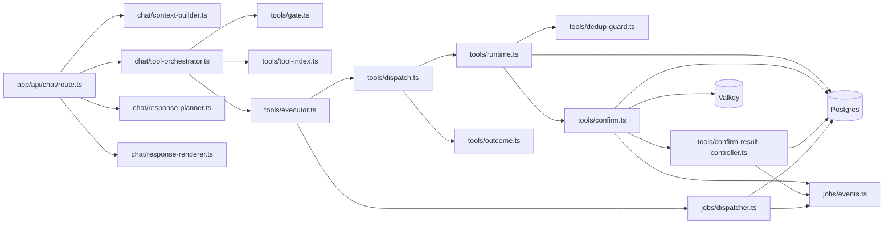
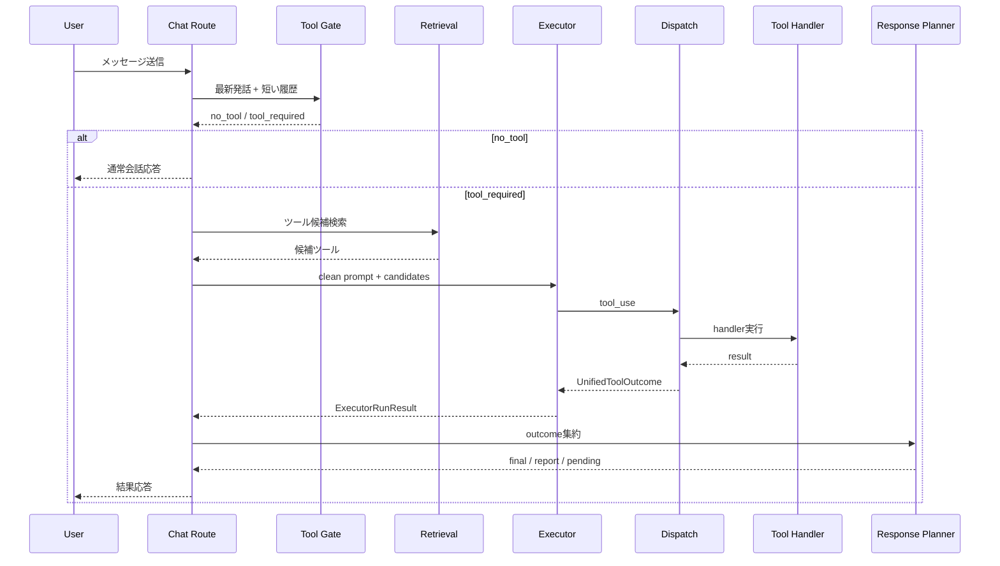
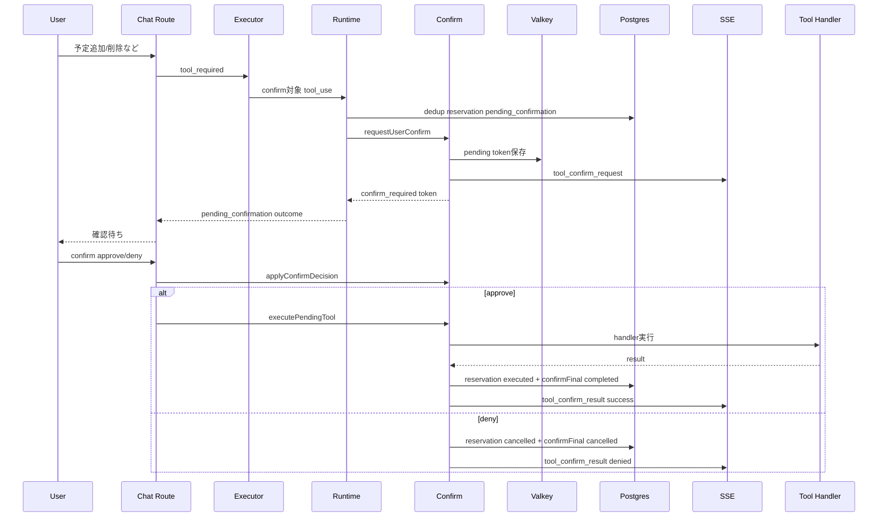
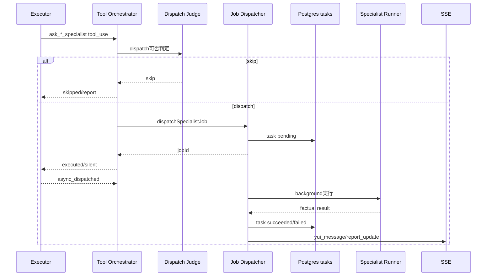

# Tool Use Implementation Report

最終更新: 2026-06-23

## 結論

v0.2 以降のツール利用リファクタリングは、主要な実行ロジックについて完了扱いにできる。

現在の設計は、人格を持つ会話生成と、ツール要否判定・ツール選択・実行・結果報告を分離している。弱めのローカル LLM を前提にしても、誤実行と二重報告を抑えるための状態管理、dedup、confirm、eval が入っている。

残る改善余地は、より広い自動 eval コーパス、CI 上の DB/LLM 統合ゲート、分散プロセス化した場合の Redis/pubsub/lock 設計である。単一ユーザー・単一ホスト前提の常用エージェントとしては、基盤部分は実用段階に近い。

## 実装方針

ツール利用は次の責務に分離した。

- `Tool Gate`: 最新発話と短い履歴から、ツールが必要かだけを判定する。
- `Tool Retrieval`: 全ツールをそのまま渡さず、発話に関連する候補へ絞る。
- `Executor`: 人格なしの clean prompt でツール名と引数だけを選ぶ。
- `Dispatch`: direct tool / confirm / specialist bridge を構造化された outcome に変換する。
- `Dedup`: 同一 mutation の重複実行を reservation と embedding/lexical 判定で抑える。
- `Confirm`: destructive / external send 系を pending にし、ユーザー許可後に Phase B で実行する。
- `Reporter`: 実行結果を `UnifiedToolOutcome` と task state から報告する。
- `Reconciliation`: pending/running/confirmFinal の不整合候補を検出し、安全なものだけ修復する。

## モジュール関係

## 通常ツール実行

## Confirm Phase A/B

## Specialist Bridge

## Eval / Regression

現在の主要ゲートは次の通り。

- `npm run check`: typecheck / lint / deterministic runtime eval
- `npm run check:tool-model`: Gate LLM / Executor LLM / Orchestrator LLM / Dedup embedding
- `npm run check:tool-integration`: DB state / reconciliation / confirm Phase B / health / domain integration

追加された重要 eval:

- R21: `eval:dedup-embed`
- R22/R25: `eval:executor-llm`
- R26: `eval:tool-orchestrator-llm`
- R27: `eval:tool-confirm-phaseb`
- R28: `eval:tools` 内の specialist bridge fixture

## 完了基準

ツール利用リファクタリングは、以下を満たした時点で完了とする。

- ツール要否、選択、実行、confirm、report が分離されている
- mutation の重複実行が dedup で抑止される
- destructive / external send は confirm Phase B でのみ実行される
- pending confirmation は完了報告候補にならない
- event_id なし削除は直接削除に進まない
- Executor / Orchestrator / Confirm Phase B / Specialist bridge の回帰evalがある
- `npm run check` と `npm run check:tool-model` が通る

## 残リスク

- 実 LLM eval はモデル依存なので、ローカルモデル変更時は `check:tool-model` を必ず再実行する。
- `check:tool-integration` は実 DB / OAuth / 外部依存の状態に左右されるため、CI の必須ゲートにはしていない。
- 複数プロセス構成にする場合、SSE と confirm pending の状態共有を Redis pub/sub などへ拡張する必要がある。
- 画像入力を前提にしたツール起動は、現状の Executor 履歴では十分に扱えていない。
